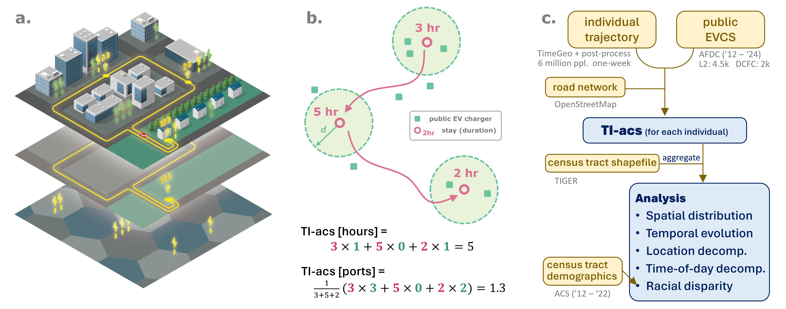
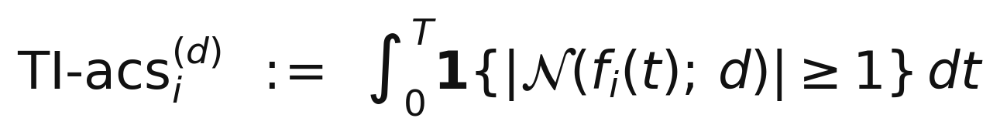

<div align="center">



# TI-acs: Trajectory-Integrated Public EVCS Accessibility

#### A mobility-based accessibility metric for public EV charging stations

[](https://doi.org/10.1016/j.scs.2026.107491) &nbsp;&nbsp;
[](https://arxiv.org/abs/2505.12145) &nbsp;&nbsp;
[](https://scholar.google.com/scholar?cites=15010848620299686887)

[](LICENSE) &nbsp;&nbsp;
[](LICENSE-DATA) &nbsp;&nbsp;
[](https://python.org) &nbsp;&nbsp;
[](https://docs.astral.sh/uv/)

<p align="center">
<a href="#quick-start">Quick start</a> |
<a href="#whats-in-the-repo">What's in the repo</a> |
<a href="#figure--notebook-map">Figure map</a> |
<a href="#data-column-schema">Data schema</a> |
<a href="#data-sources--provenance">Data sources</a> |
<a href="#citation">Citation</a>
</p>

</div>

---

**TI-acs** quantifies public EV charging accessibility by integrating an individual's **full daily trajectory** — home, workplace, and other stay locations — rather than evaluating accessibility only at the home address. We compute it for ~6 million Bay-Area residents over 2012–2024 and show differences across time, location, charging period, and race in public-charger access.

### How is TI-acs defined?

Let $f_i(t)$ be individual $i$'s location at time $t \in [0, T]$ (e.g. one day), and $\mathcal{N}(s; d)$ the set of public chargers within walking distance $d$ of location $s$ (we use $d = 1$ km, ≈ 10–15 min walk). Our main metric is **TI-acs [hours]**:

<div align="center">
= 1} dt" width="640">
</div>

i.e., the total time during which at least one public charger is within $d$ of where the individual is.

The empirical distribution of TI-acs across census tracts drives all spatial, temporal, and racial-equity analyses in the paper.
This repository provides **aggregate, tract-level** TI-acs statistics and the analysis notebooks that reproduce **Figures 2–8** of the paper. 
*Raw trajectory-level data and the upstream simulation/processing pipeline are **not** included in this version.*

> Ju Y., Wu J., Su Z., Li L., Zhao J., Gonzalez M. C., Moura S. J. *Trajectory-integrated accessibility analysis of public electric vehicle charging stations.* **Sustainable Cities and Society**, 2026. [doi:10.1016/j.scs.2026.107491](https://doi.org/10.1016/j.scs.2026.107491) · [arXiv:2505.12145](https://arxiv.org/abs/2505.12145)

---

## Quick start

```bash
git clone https://github.com/eCal-UCB/TI-acs-public.git
cd TI-acs-public
```

<details>
<summary><b>Install <code>uv</code></b> (optional — skip if you already have it). Click for per-OS commands.</summary>

**macOS / Linux**
```bash
curl -LsSf https://astral.sh/uv/install.sh | sh
```

**Windows (PowerShell)**
```powershell
powershell -ExecutionPolicy ByPass -c "irm https://astral.sh/uv/install.ps1 | iex"
```

**Via pipx / pip**
```bash
pipx install uv     # or: pip install uv
```

Full installer reference: [docs.astral.sh/uv/getting-started/installation](https://docs.astral.sh/uv/getting-started/installation/).

</details>

Then sync the project and launch Jupyter — the same two commands on all OSes:

```bash
uv sync                          # installs Python 3.11 + locked deps into .venv/
uv run jupyter lab notebooks/    # open the three notebooks and Run All
```

> Prefer VS Code? Open the repo folder, then in any notebook click **Select Kernel** (top-right) and pick the `.venv` interpreter created by `uv sync`.

Output PNGs land in `outputs/figs/`. The included `uv.lock` fixes dependency versions, so re-running reproduces the published results.

---

## What's in the repo

```
ti-acs/
├── notebooks/
│   ├── 01_maps.ipynb         # Fig. 2 + Fig. 7 + Fig. 8 — tract-level choropleths
│   ├── 02_breakdowns.ipynb   # Fig. 3 + Fig. 5 — location / TOU / distance breakdowns
│   └── 03_equity.ipynb       # Fig. 4 + Fig. 6 — race CDF + OLS regression
├── ti_acs/                   # small importable package
│   ├── io.py                 #   minimal data loaders + (year, dist) validators
│   ├── style.py              #   color palettes, label dicts, Bay-area FIPS
│   └── plotting.py           #   matplotlib figure-assembly helpers
├── data/                     # aggregate inputs (~53 MB)
│   ├── ti_acs_hours_tract_annual.xlsx       # Figs. 2, 3, 4, 7
│   ├── ti_acs_hours_tract_multidist.xlsx    # Fig. 5
│   ├── ti_acs_ports_tract_annual.xlsx       # Fig. 8
│   ├── acs_tract_demographics.xlsx          # Figs. 4, 6
│   ├── sf_bay_public_evcs.csv               # Fig. 2 (port count trend)
│   ├── race_regression_I{0,1,4}.xlsx        # Figs. 4, 6 (cached regression)
│   └── shapefiles/                          # Bay-area tracts + CA counties
└── outputs/figs/             # generated figures land here
```

### Figure → notebook map

| Paper figure | Notebook | Output PNG |
|---|---|---|
| **Fig. 2** — 2024 TI-acs hours map + 2012–2024 trend (Results §3.1) | `01_maps.ipynb` | `outputs/figs/fig2_access_map.png` |
| **Fig. 3** — Location & TOU breakdown + Gini trend (Results §3.2–3.4) | `02_breakdowns.ipynb` | `outputs/figs/fig3_breakdown.png` |
| **Fig. 4** — Racial-disparity CDF + regression coefficients (Results §3.5) | `03_equity.ipynb` | `outputs/figs/fig4_race.png` |
| **Fig. 5** — Distance-threshold sensitivity (Discussion §4) | `02_breakdowns.ipynb` | `outputs/figs/fig5_sensitivity.png` |
| **Fig. 6** — Race regression with vs. without income controls (Discussion §4) | `03_equity.ipynb` | `outputs/figs/fig6_race_reg_robustness.png` |
| **Fig. 7** — Multi-year TI-acs hours maps (Appendix) | `01_maps.ipynb` | `outputs/figs/fig7_TI-acs-hours-multiyear.png` |
| **Fig. 8** — Multi-year TI-acs ports maps (Appendix) | `01_maps.ipynb` | `outputs/figs/fig8_TI-acs-ports-multiyear.png` |


### How notebooks and the package divide labor

The notebooks are written to make each analysis step easy to follow: the research methodology (Gini coefficient, segment decomposition, dominant-race assignment, OLS regression) is written inline so a reader can audit it directly against §2 of the paper. The `ti_acs/` package contains shared utilities — file IO with index normalization, plot-style constants, and matplotlib boilerplate.

If you want to:
- **Just reproduce the figures** — open the notebooks and Run All.
- **Understand the methodology** — read each notebook top-to-bottom; processing steps are shown directly in each notebook.
- **Rerun the OLS regression from scratch** — set `USE_CACHE = False` in Notebook 03; the inline `fit_race_regression` recomputes every coefficient.


### Configuration

Each notebook starts with **one configuration cell** holding all parameters used for that figure. The defaults reproduce the published figures. Each parameter is annotated with the alternative values the shipped data supports — anything else triggers a `ValueError` with a direct message from `ti_acs.io.validate_config`. For example, the annual TI-acs files contain only `DIST = 1000 m`; the multi-distance file used for Fig. 5 supports `{500, 1000, 2000, 3000 m}` at four year snapshots (2015, 2018, 2021, 2024).

### Data column schema

The TI-acs stats files are wide tract-level tables. Each row is a census tract (zero-padded GEOID, e.g., `"06081608600"`). Each column is named `"{year}_{level}_{dist}_{metric}"`:

- `year` ∈ 2012..2024
- `level` ∈ {L2, DCFC}
- `dist` is the distance threshold in meters
- `metric` ∈ {`all`, `home`, `HnW`, `SuperOffPeak`, `OffPeak`, `Peak`}

The duration files store TI-acs as a **fraction of the day** (0..1). The notebooks multiply by 24 to get hours-per-day, matching how the paper reports it.

Each xlsx has four sheets: `mean`, `pct25`, `pct75`, `num_users`. The first three are *within-tract* statistics across the tract's residents; `num_users` is the resident count. The figures use the `mean` sheet — i.e. each tract is colored by the mean TI-acs across its residents, then across-tract statistics are computed for trend bars, Gini, etc.

---

## Data sources & provenance

| Asset | Source | License | Notes |
|---|---|---|---|
| `ti_acs_*.xlsx` | Derived in this work from TimeGeo simulated trajectories + AFDC EVCS locations | CC-BY 4.0 (this repo) | Aggregated to census tract; individual trajectories not redistributed. |
| `acs_tract_demographics.xlsx` | U.S. Census Bureau, American Community Survey 1-year estimates 2012-2022 | Public domain | Aggregated from raw ACS (upstream pipeline not in repo). |
| `sf_bay_public_evcs.csv` | U.S. DOE Alternative Fuels Data Center, accessed June 2024 | Public domain (AFDC) | Filtered to public chargers in the 6-county study area. |
| `data/shapefiles/CA_County/` | California State GeoPortal | Public domain | Full state. |
| `data/shapefiles/CA_Tract_BayArea/` | TIGER/Line 2021 (U.S. Census Bureau), subset to 6 Bay counties | Public domain | Pre-clipped from full CA shapefile to ~7 MB. |
| `race_regression_I{0,1,4}.xlsx` | Cached OLS output from `fit_race_regression` in `03_equity.ipynb` | CC-BY 4.0 (this repo) | Reproducible by setting `USE_CACHE = False`. |

The TimeGeo simulation framework is described in:
> Jiang, S. *et al.* The TimeGeo modeling framework for urban mobility without travel surveys. *PNAS*, 2016. [doi:10.1073/pnas.1524261113](https://doi.org/10.1073/pnas.1524261113)

---

## Citation

If this code or data is useful to your research, please cite the paper:

**Plain text**

> Ju, Y., Wu, J., Su, Z., Li, L., Zhao, J., Gonzalez, M. C., Moura, S. J. (2026). Trajectory-integrated accessibility analysis of public electric vehicle charging stations. *Sustainable Cities and Society*. https://doi.org/10.1016/j.scs.2026.107491

**BibTeX**

```bibtex
@article{ju2026tiacs,
  title   = {Trajectory-integrated accessibility analysis of public electric vehicle charging stations},
  author  = {Ju, Yi and Wu, Jiaman and Su, Zhihan and Li, Lunlong and
             Zhao, Jinhua and Gonzalez, Marta C. and Moura, Scott J.},
  journal = {Sustainable Cities and Society},
  year    = {2026},
  doi     = {10.1016/j.scs.2026.107491},
  url     = {https://doi.org/10.1016/j.scs.2026.107491},
  eprint  = {2505.12145},
  archivePrefix = {arXiv}
}
```

Machine-readable metadata is in [`CITATION.cff`](CITATION.cff). See works citing this paper on [Google Scholar](https://scholar.google.com/scholar?cites=15010848620299686887). The "cited by" badge above is refreshed daily from Semantic Scholar + Crossref by [`.github/workflows/update-citations.yml`](.github/workflows/update-citations.yml); the count Scholar reports may be higher because Scholar indexes more sources.

---

## License

- **Code** (everything under `ti_acs/`, `notebooks/`, root `*.toml`/`*.cff`): MIT — see [LICENSE](LICENSE).
- **Data** (everything under `data/`): CC-BY 4.0 — see [LICENSE-DATA](LICENSE-DATA). Re-distributed public shapefiles retain their original public-domain status.

---
The code base is refactored by *Claude Code* from the original research codebase. There may contain mistakes or inconsistencies with the paper. Please reach out if you find any issues or have questions about the code or data! We welcome contributions and improvements to this repository.
